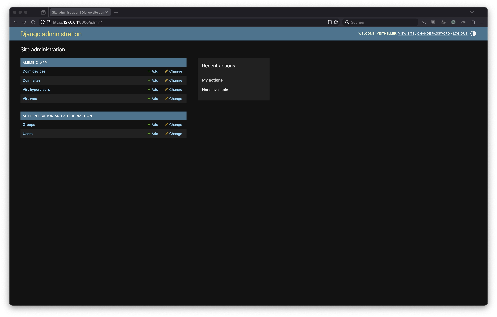
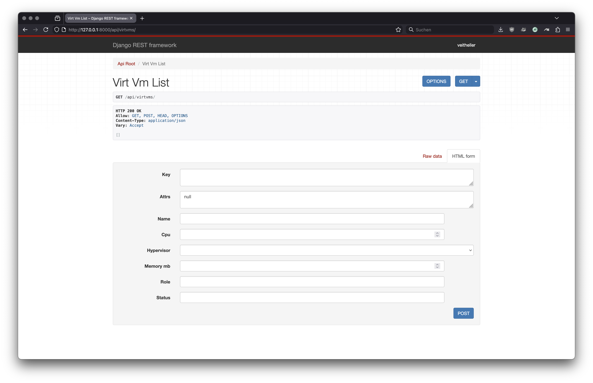

# alembic demo

---

## the model

```yaml
schema:
  types:
    dcim.site:
      key:
        slug: { type: slug }
      fields:
        name: { type: string }
        slug: { type: slug }
        status: { type: string }
    dcim.device:
      key:
        name: { type: slug }
      fields:
        name: { type: string }
        site: { type: ref, target: dcim.site }
        role: { type: ref, target: dcim.device_role }
        device_type: { type: ref, target: dcim.device_type }
        status: { type: string }
```

---

## objects

```yaml
objects:
  - uid: "10000000-...-000000000001"
    type: dcim.site
    key: { slug: "fra1" }
    attrs:
      name: "FRA1"
      slug: "fra1"
      status: "active"

  - uid: "10000000-...-000000000005"
    type: dcim.device
    key: { name: "leaf01" }
    attrs:
      name: "leaf01"
      site: "10000000-...-000000000001"
      status: "active"
```

no backend IDs. references are stable UUIDs.

---

## validate

```bash
$ alembic validate -f core-v1.yaml
ok
```

offline. checks schema, keys, UID uniqueness, ref integrity.

---

## plan

```bash
$ alembic plan -f core-v1.yaml -o plan.json
plan: 5 to create, 0 to update, 0 to delete
plan written to plan.json
```

deterministic diff: desired model vs observed backend state.

---

## apply

```bash
$ alembic apply -p plan.json --interactive
create dcim.site {"slug":"fra1"}? [y/N] y
create dcim.device_role {"slug":"leaf"}? [y/N] y
create dcim.manufacturer {"slug":"acme"}? [y/N] y
create dcim.device_type {"slug":"leaf-48p"}? [y/N] y
create dcim.device {"name":"leaf01"}? [y/N] y
applied 5 operations
```

each op is a separate API call. state tracks UID to backend ID.

---

## evolve the model

```yaml
  - uid: "10000000-...-000000000005"
    type: dcim.device
    key: { name: "leaf01" }
    attrs:
      status: "staged"        # was "active"

  - uid: "10000000-...-000000000006"
    type: dcim.device
    key: { name: "leaf02" }   # new
    attrs: ...
```

**change:** add leaf02, change leaf01 status.

---

## re-plan

```bash
$ alembic plan -f core-v2.yaml -o plan.json
plan: 1 to create, 1 to update, 0 to delete
plan written to plan.json
```

same tool and workflow. alembic only touches what changed.

---

## custom types

```yaml
virt.hypervisor:
  key:
    name: { type: slug }
  fields:
    name: { type: string }
    site: { type: ref, target: dcim.site }
    host_device: { type: ref, target: dcim.device }
    platform: { type: string }
virt.vm:
  key:
    name: { type: slug }
  fields:
    hypervisor: { type: ref, target: virt.hypervisor }
    cpu: { type: int }
    memory_mb: { type: int }
```

no plugin needed. your schema, your types.

---

## validate custom types

```bash
$ alembic validate -f extended-model.yaml
ok
```

same workflow. custom fields are projected into your backend automatically.

---

## cast

```bash
$ alembic cast django -f extended-model.yaml -o mybackend/
wrote mybackend/models.py
wrote mybackend/serializers.py
wrote mybackend/views.py
wrote mybackend/urls.py
```

scaffolds a Django REST backend from your schema. deploy and point alembic at it.

---

## cast — admin

{height=80%}

---

## cast — API

{height=80%}

---

## other backends

```bash
$ alembic plan -f model.yaml -b netbox -o plan.json
$ alembic plan -f model.yaml -b nautobot -o plan.json
$ alembic plan -f model.yaml -b generic -o plan.json
```

same model, different backends. generic adapter works with any REST API.

---

## one model, many targets

```yaml
model.yaml
  → validate → plan → apply
                         ↓
                    netbox / nautobot / generic / cast
```

your model describes your world, not the other way around.
